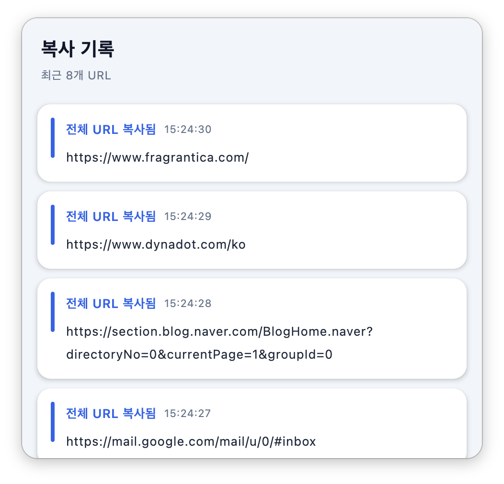

# CopyUrl

A tiny macOS menu-bar utility that copies the current **Google Chrome** tab URL with a global hotkey, strips tracking parameters on double-tap, and keeps a **history popup** you can re-copy from.

The UI is **Compose Multiplatform (Material 3)**; everything macOS-native — the menu-bar item, window shadow, global hotkey, main-thread dispatch — is driven directly through **JNA** (no Swift/Obj-C glue). Packaged as a self-contained `.app` with `jpackage`.

<p align="center">
  
</p>

## Features

- **⇧⌘C** — copy the current Chrome tab's full URL
- **⇧⌘C ⇧⌘C** (double-tap within 0.5s) — copy with tracking parameters stripped (`utm_*`, `gclid`, `fbclid`, `igshid`, …)
- Menu-bar only (no Dock icon), native macOS notification on copy
- **History popup** — click the menu-bar icon to open a Compose window, anchored under the icon, listing recent copies; click any card to re-copy
  - Closes on click-away, rounded corners with a native drop shadow, top fading edge, always scrolls to the top when opened
- Launches at login

## How it works

| Concern | Implementation |
|---|---|
| Global hotkey | Carbon `RegisterEventHotKey` via JNA — **no Accessibility permission** needed |
| Read Chrome URL | AppleScript (`osascript`) — Apple Events |
| Strip trackers | Pure Kotlin URL parsing (whitelist of known trackers) |
| Clipboard | `pbcopy` |
| Menu-bar icon | Native `NSStatusItem` + SF Symbol (`link`) via the Objective-C runtime |
| History UI | Compose Multiplatform (Material 3) in a transparent, undecorated `Window` |
| Window shadow / focus | `NSWindow.setHasShadow` + `activateIgnoringOtherApps` via JNA (an accessory app must do this itself) |
| Icon-anchored position | Read the status item's `NSWindow.frame` (`NSRect`) to place the popup under the icon |
| Main-thread dispatch | `dispatch_async_f` onto `_dispatch_main_q` via JNA (AppKit must be touched on the main thread) |
| Notification | `NSUserNotification` (falls back to `osascript`) |

## Build & install

```bash
./build_app.sh
```

Compiles → packages a self-contained `.app` (bundled JRE) with `jpackage` → **self-signs** it → installs to `/Applications` → launches.

### Code signing (important)

The app is **self-signed**, not notarized. Ad-hoc signing is *not* enough — macOS won't grant Automation (Apple Events) permission to an ad-hoc binary, and it won't even show up in System Settings → Privacy → Automation. So `build_app.sh` re-signs with a local certificate named **`CopyUrl Self-Signed`**.

Create it once (Keychain Access → Certificate Assistant → *Create a Certificate…* → Code Signing, self-signed), or via CLI:

```bash
openssl req -x509 -newkey rsa:2048 -nodes -keyout cu.key -out cu.crt -days 3650 \
  -subj "/CN=CopyUrl Self-Signed" \
  -addext "extendedKeyUsage=critical,codeSigning"
security import cu.key -k ~/Library/Keychains/login.keychain-db -T /usr/bin/codesign -A
security import cu.crt -k ~/Library/Keychains/login.keychain-db -T /usr/bin/codesign -A
```

### First run

- On the first copy, macOS asks **"CopyUrl wants to control Google Chrome" → Allow** (needed to read the tab URL).
- If a Chrome Picture-in-Picture window is frontmost, CopyUrl skips its blank window and focuses the first real Chrome browser window with an active tab URL.
- Add `CopyUrl.app` to **System Settings → General → Login Items** to launch at login.

## Customizing the tracker list

Edit `src/main/kotlin/dev/jisungbin/copyurl/TrackerCleaner.kt`:

- `EXACT` — exact-match keys (`gclid`, `fbclid`, …)
- `PREFIXES` — prefix-match (`utm_`, `pk_`, …)

Only whitelisted trackers are removed; normal params (`id`, `q`, `page`, …) are never touched.

## Project layout

```
Main.kt            entry point · hotkey wiring · Compose application & history window
CopyUrlAppState.kt history state holder (visibility + recent URLs)
HistoryWindow.kt   Compose Material 3 history UI (cards, fading edge)
CopiedUrlEntry.kt  one history record
MainDispatch.kt    run work on the macOS main thread (libdispatch via JNA)
CarbonHotkey.kt    JNA → Carbon RegisterEventHotKey
MacStatusBar.kt    NSStatusItem + SF Symbol + click action (objc via JNA)
ObjC.kt            Objective-C runtime helper (objc_msgSend, NSRect, class pairs)
ChromeUrl.kt       current Chrome tab URL via osascript
TrackerCleaner.kt  strip tracking query params
ClipboardUtil.kt   pbcopy
Notifier.kt        native notification (+ osascript fallback)
Dbg.kt             file logger (~/copyurl-debug.log)
```

## Stack

Kotlin 2.4.0-RC2 · Compose Multiplatform 1.12.0-alpha01 (Material 3) · JNA 5.18.1 · JDK 21 · `jpackage`

## License

MIT
